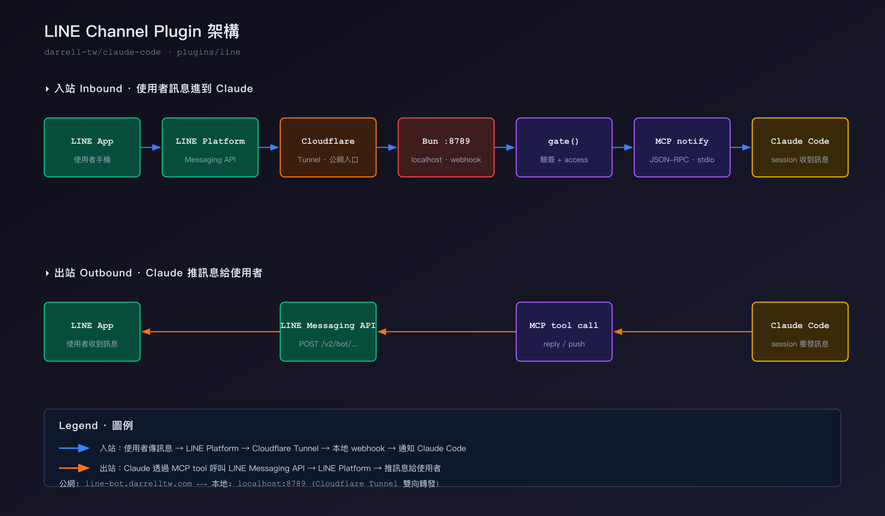

# LINE Channel for Claude Code

[English](README.md) | [繁體中文](README.zh-TW.md) | [日本語](README.ja.md)

ปลั๊กอิน LINE Messaging API แบบครบฟังก์ชันสำหรับ Claude Code — สะพานรับส่งข้อความพร้อมระบบควบคุมการเข้าถึงในตัว

## คุณสมบัติ

- **รับส่งข้อความสองทาง**: ส่งและรับข้อความผ่าน LINE
- **ควบคุมการเข้าถึง**: ระบบจับคู่ (pairing), รายการอนุญาต (allowlist), รองรับกลุ่มด้วยการ @mention
- **ตอบกลับอัจฉริยะ**: ใช้ replyToken ฟรีเมื่อมี, สลับเป็น push อัตโนมัติเมื่อหมดอายุ
- **แบ่งข้อความอัตโนมัติ**: ข้อความยาวแบ่งที่ 5000 ตัวอักษร โดยตัดที่ขอบย่อหน้า
- **แอนิเมชัน Loading**: แสดงสถานะกำลังพิมพ์ขณะ Claude ประมวลผล
- **รองรับไฟล์แนบ**: รูปภาพ, วิดีโอ, เสียง, ไฟล์ดาวน์โหลดอัตโนมัติไปยัง inbox
- **ความปลอดภัย Webhook**: ตรวจสอบลายเซ็น HMAC-SHA256 ทุกเหตุการณ์ขาเข้า

## สิ่งที่ต้องมี

- [Bun](https://bun.sh) runtime
- URL สาธารณะชี้ไปที่ localhost:8789 (เช่น [cloudflared](https://developers.cloudflare.com/cloudflare-one/connections/connect-apps/), [ngrok](https://ngrok.com/))
- บัญชี LINE Developers ที่สร้าง Messaging API channel แล้ว

> **สำคัญ**: อย่ารัน `bun server.ts` โดยตรง! LINE Channel เป็น MCP Server ต้องเริ่มผ่านระบบ plugin ของ Claude Code เท่านั้นจึงจะรับข้อความได้

## การตั้งค่า

> ลำดับสำคัญ: **เตรียม `.env` ให้พร้อมก่อนติดตั้ง plugin**。MCP server จะอ่าน `~/.claude/channels/line/.env` ตอน spawn ครั้งแรก ถ้าไฟล์ขาดหรือไม่ครบ server จะ exit และ `/reload-plugins` จะไม่ลอง spawn ใหม่ — ต้องปิด Claude Code แล้วเปิดใหม่ทั้งหมดเพื่อกู้คืน

### 1. LINE Developers Console

1. สร้าง Messaging API channel ที่ [LINE Developers](https://developers.line.biz/)
2. รับ **Channel Access Token** (แบบถาวร) และ **Channel Secret**
3. ปิดข้อความตอบกลับอัตโนมัติและข้อความต้อนรับใน LINE Official Account

### 2. URL สาธารณะ (webhook tunnel)

คุณต้องมี URL สาธารณะที่ forward ไปยัง `localhost:8789` เช่น:

```bash
# ตัวเลือก A: Cloudflare Tunnel
cloudflared tunnel create line-claude
cloudflared tunnel route dns line-claude mybot.example.com
cloudflared tunnel run line-claude

# ตัวเลือก B: ngrok
ngrok http 8789
```

ปล่อย tunnel ทำงานต่อไป

### 3. เขียน credentials

สร้าง `~/.claude/channels/line/.env` ด้วย editor โดยตรง:

```
LINE_CHANNEL_ACCESS_TOKEN=token-ของคุณ
LINE_CHANNEL_SECRET=secret-ของคุณ
LINE_PUBLIC_URL=https://mybot.example.com
```

```bash
chmod 600 ~/.claude/channels/line/.env
```

> มีอีกวิธีคือ slash command `/line:configure <token> <secret>` แต่ token กับ secret จะไปอยู่ใน shell history และ transcript ของ Claude Code session การแก้ไฟล์ตรงๆ ปลอดภัยกว่า

### 4. ตั้ง Webhook URL ใน LINE Console

LINE Developers Console → channel ของคุณ → **Messaging API**:

- **Webhook URL**: `https://mybot.example.com/webhook`
- **Use webhook**: ON
- คลิก **Verify** → ควรได้ `Success`

### 5. ติดตั้ง plugin

```
/plugin marketplace add darrell-tw/claude-code
/plugin install line@darrell-tw-plugins
/reload-plugins
```

ถ้าทำขั้นตอน 1–3 ก่อนแล้ว `.env` พร้อม MCP server จะ spawn ขึ้นมาทันทีที่ `/reload-plugins` ถ้าลำดับไม่ถูก ต้องปิด Claude Code แล้วเปิดใหม่

### 6. จับคู่บัญชี

1. ส่งข้อความหา bot ของคุณทาง LINE
2. Bot จะตอบกลับด้วยรหัสจับคู่ 6 หลัก
3. ใน Claude Code: `/line:access pair <code>`

### 7. ล็อกการเข้าถึง

เมื่อจับคู่ทุกคนเรียบร้อยแล้ว:

```
/line:access policy allowlist
```

จากนี้ผู้ส่งที่ไม่อยู่ใน allowlist จะถูก server drop ทิ้ง ไม่สร้าง pairing code อีก

## รูปแบบการตอบกลับ

ค่าเริ่มต้นคือข้อความธรรมดา เปิดใช้ Flex Message แบบมีโครงสร้าง:

```
/line:access set replyFormat flex
```

สลับกลับเป็นข้อความธรรมดา: `/line:access set replyFormat text`

## เครื่องมือ

| เครื่องมือ | รายละเอียด |
| --- | --- |
| `reply` | ตอบกลับข้อความ LINE (replyToken → สลับเป็น push) |
| `push` | ส่งข้อความแบบ push (ไม่ต้องใช้ replyToken) |
| `show_loading` | แสดงสถานะกำลังพิมพ์ |
| `get_profile` | ดึงข้อมูลผู้ใช้: ชื่อ, รูปโปรไฟล์, ข้อความสถานะ |

## สถาปัตยกรรม



**Inbound (แถวบน)**: ข้อความจากผู้ใช้เข้ามาทาง LINE Platform → Cloudflare Tunnel → Bun webhook server ที่ `localhost:8789` → ผ่าน `gate()` ตรวจลายเซ็นและ access policy → แจ้ง Claude Code ผ่าน MCP stdio

**Outbound (แถวล่าง)**: Claude เรียก MCP tool (`reply` / `push`) → ส่ง POST ไปที่ LINE Messaging API → LINE Platform ส่งข้อความถึงผู้ใช้

## การควบคุมการเข้าถึง

ดูเอกสารฉบับเต็มที่ [ACCESS.md](ACCESS.md)

## สัญญาอนุญาต

Apache-2.0
